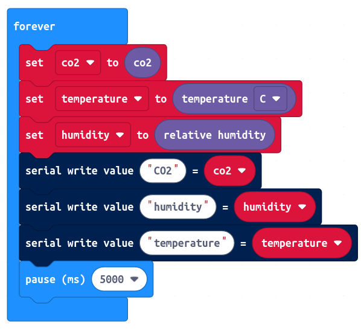
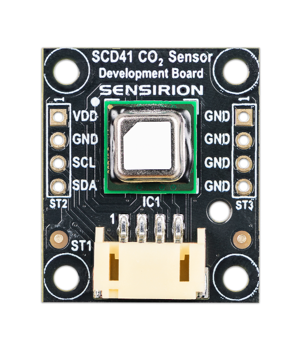

# Sensirion SCD41 Makecode Extension

Makecode extension for the Sensirion SCD41 CO2 development board connected to the micro:bit platform.

This extension allows you to read CO2, temperature and relative humidity values with an interval of 5 seconds.

## Supported Targets

* PXT/microbit
* Calliope mini

## I2C Address

* 0x62

## Usage

open your microbit makecode project, in "+ Extension", paste the following URL:

https://github.com/Sensirion/makecode-extension-scd41

## Demo



## API

Get CO2 value in ppm
```ts
function get_co2()
```

Get temperature in degree celsius. Takes an optional argument to change to fahrenheit.
```ts
function get_temperature()
```

Get relative humidity in percent
```ts
function get_relative_humidity()
```

Start measurement on SCD41 development board. This method will be automatically called on initialization.
If you call `stop_continuous_measurement()` you have to call this method again before co2, temperature and humidity
values can be retrieved again.
```ts
function start_continuous_measurement()
```

Stop measurement on SCD41 development board. After calling this function, no more sensor values can be read out
anymore until you call `start_continuous_measurement`
```ts
function stop_continuous_measurement()
```

## Hardware



## License

[MIT](LICENSE)

Copyright (c) 2021, Sensirion AG

